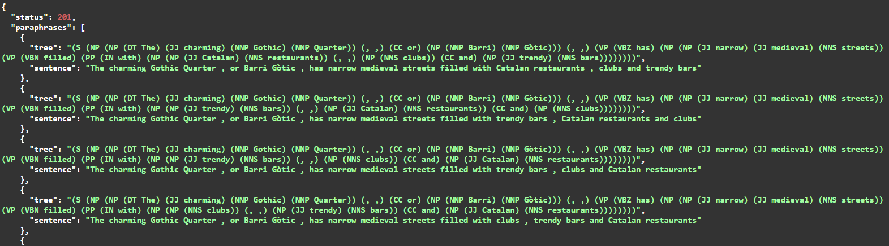

# Paraphrasing endpoint

## Description
This endpoint rephrases your current sentence by switching the NP (noun phrase) with each other without losing meaning

## Installation
```
git copy https://github.com/AVyha/paraphrasing_endpoint.git
python -m venv venv
venv\Scripts\activate
pip install -m requirements.txt
```

## How to use
1. Run in terminal `python main.py`
2. Open in browser `localhost:8000/docs`
3. Open "/paraphrase" endpoint
4. Place your syntax tree in the "tree" variable

For example, you can use this syntax tree:

```
(S(NP(NP (DT The) (JJ charming) (NNP Gothic) (NNP Quarter))(, ,)(CC or)(NP (NNP Barri) (NNP Gòtic)))(, ,)(VP(VBZ has)(NP(NP (JJ narrow) (JJ medieval) (NNS streets))(VP(VBN filled)(PP(IN with)(NP(NP (JJ trendy) (NNS bars))(, ,)(NP (NNS clubs))(CC and)(NP (JJ Catalan) (NNS restaurants))))))))
```

Response example

